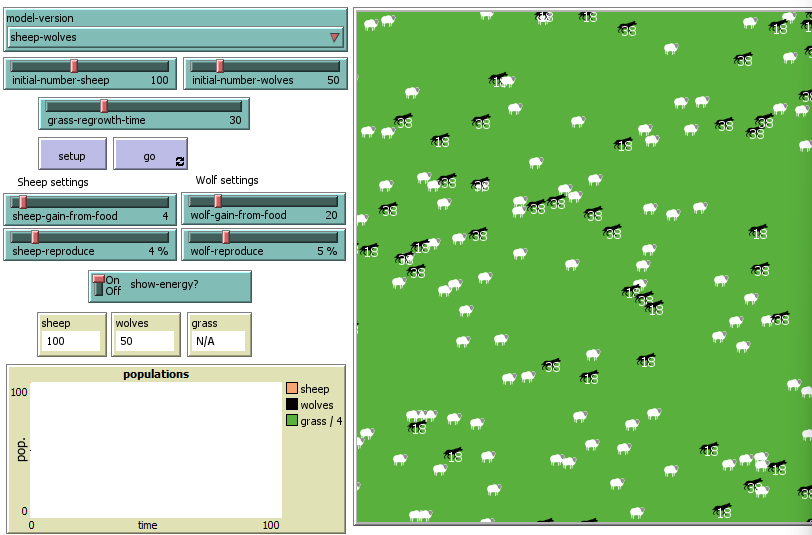
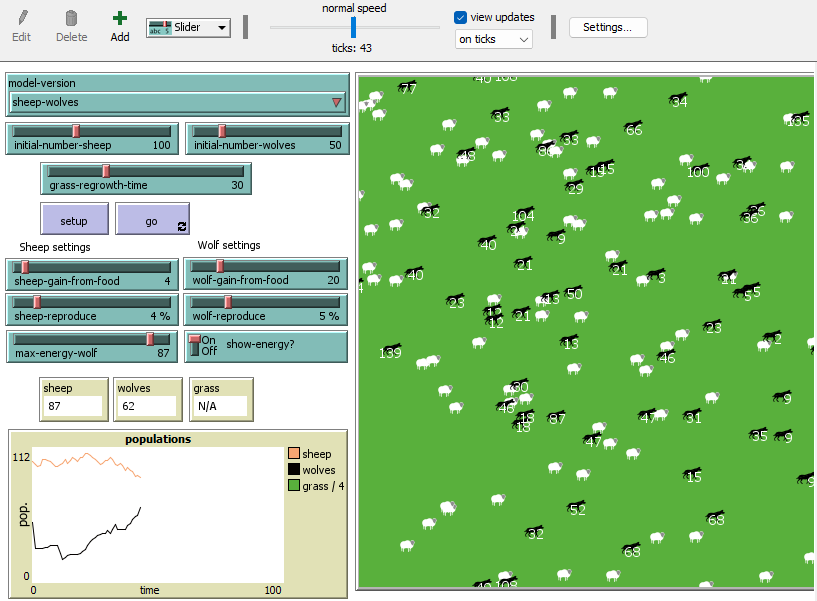
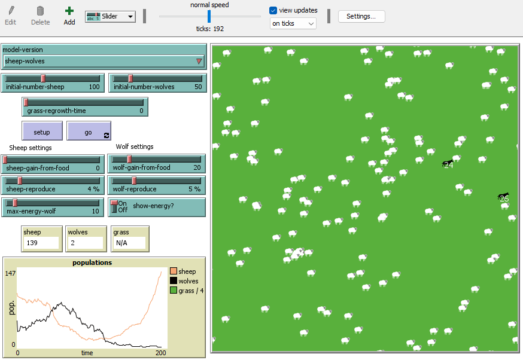
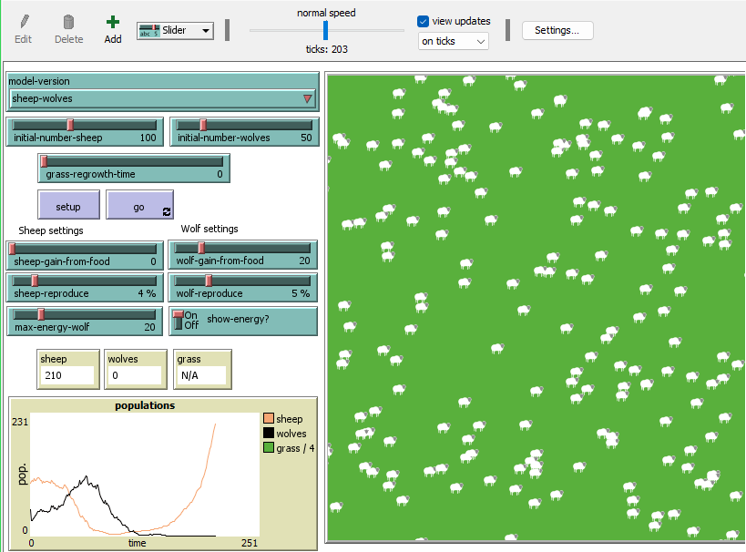
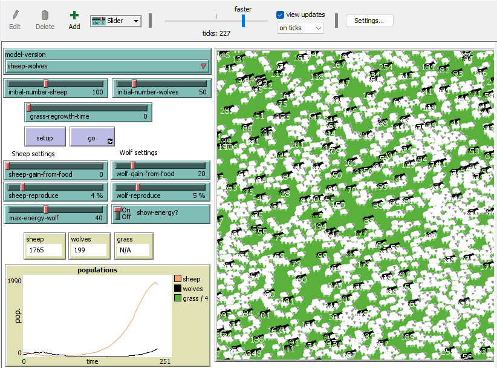
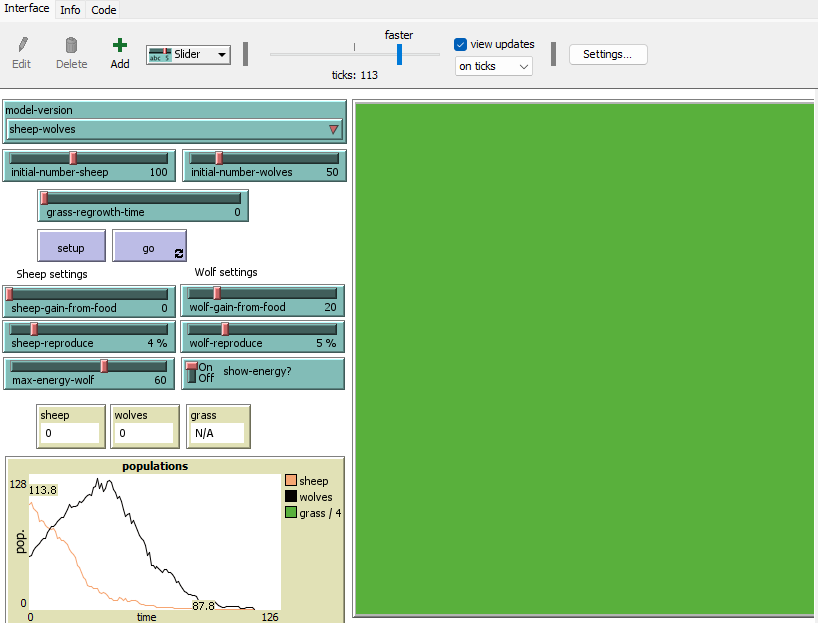
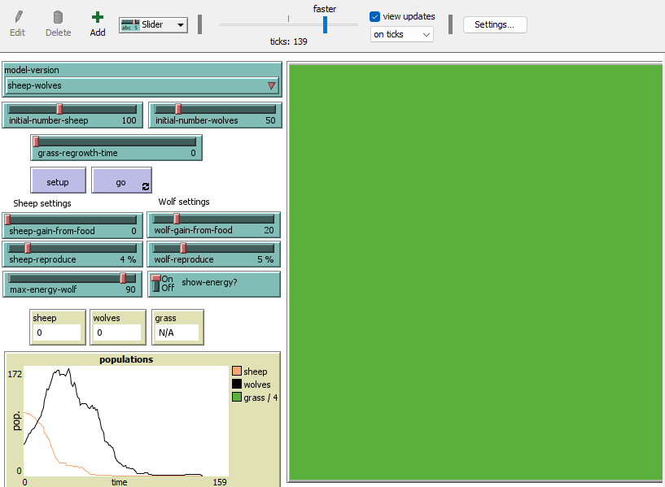

## Комп'ютерні системи імітаційного моделювання
## СПм-22-6, Гунько Михайло Андрійович
### Лабораторна робота №**2**. Редагування імітаційних моделей у середовищі NetLogo

 

### Варіант 7, Wolf Sheep Predation. Модель взаємоіснування хижаків та їх жертв. Модель у середовищі NetLogo:
[Wolf Sheep Predation](http://www.netlogoweb.org/launch#http://www.netlogoweb.org/assets/modelslib/Sample%20Models/Biology/Wolf%20Sheep%20Predation.nlogo)

Прибрати "зграйність" вовків - тепер перед початком свого ходу вовки повинні "оглядатися", перевіряючи оточення, та обирати напрямок руху виходячи з наявності вівець та відсутності інших вовків. Якщо немає іншої можливості – переміщається випадково. При знаходженні на одній ділянці поля двох вовків залишається лише один з них. Вівці переміщаються випадковим чином, але при виявленні вовка на одній із клітин поруч змінюють напрямок на протилежний.
 

### Логіка вовків

Прибрати "зграйність" вовків - тепер перед початком свого ходу вовки повинні "оглядатися", перевіряючи оточення, та обирати напрямок руху виходячи з наявності вівець та відсутності інших вовків. Якщо немає іншої можливості – переміщається випадково. При знаходженні на одній ділянці поля двох вовків залишається лише один з них.

Вносив зміни дивлячись на приклади з моделей "**Rabbits Grass Weeds**" та "**Shepherds**".

Створив функцію для зміни у логіці переміщення вовків:

Тепер замість 
<pre>
to move  ; turtle procedure
  rt random 50
  lt random 50
  fd 1
end
</pre>
Створив процедуру
<pre>
to wolf-move
  let nearby-sheep sheep in-radius 3  ; Finding surrounding sheep within a radius of 3 units
  let nearby-wolves other wolves in-radius 3  ; Finding surrounding wolves in a radius of 3 units
  ifelse any? nearby-sheep and not any? nearby-wolves  ; If there are sheep, but there are no wolves nearby
  [
    let target one-of nearby-sheep  ; Selecting one of the nearby sheep as a target
    face target  ; Rotation in the direction of the sheep
    fd 1
  ]
  [
    just-move  ; Move in a random direction if there are no sheep nearby
  ]
  if any? nearby-wolves  ; If there are wolves nearby
  [
    let target one-of nearby-wolves
    face target  ; Selecting one of the nearby wolves as a target to be avoided
    rt 180  ; Rotation in the opposite direction from the wolf
    fd 1
    let other-wolf one-of nearby-wolves
    let patch-of-other-wolf [patch-here] of other-wolf
    if patch-of-other-wolf = patch-here  ; Checking if another wolf is nearby in the same place
    [
      die  ; If another wolf is on the same patch, die
    ]
  ]
end
</pre>
, замінив назву **move** на **just-move** для більш зрозумілого синтаксису.
А також змінив частину процедури **to go** для того, щоб процедура **wolf-move**:
<pre>
...
ask wolves [
  wolf-move
...
</pre>

 

### Логіка овець
Вівці переміщаються випадковим чином, але при виявленні вовка на одній із клітин поруч змінюють напрямок на протилежний.

Після зміни логіки переміщення вовків зробив аналогічні зміни у логіці переміщення овець для уникнення вовків:
<pre>
to sheep-move
  let nearby-wolves wolves in-radius 1  ; a variable containing a list of wolves within a radius of 1 unit from the sheep
  ifelse any? wolves in-radius 1  ; Check if there are wolves in radius 1
  [
    let target one-of nearby-wolves ; If there are wolves, choose one of them as a target
    face target
    rt 180  ; Turn the sheep so that it sees the chosen wolf
    fd 2  ; 
  ]
  [just-move]
end
</pre>

Та змінив частину процедури **to go** для того, щоб процедура **sheep-move**:

<pre>
...
ask sheep [
  sheep-move
...
</pre>

## Внесені зміни у вихідну логіку моделі, на власний розсуд:

### Додав вибір максимальної кількості енергії у вовків (аналог ситості у реальному житті):

Зробив рандомізацію початкової енергії вовків, зробивши вибір від 0 до обраного користувачем числа. Вніс деякі зміни у процедуру **setup** у ту частину, де створюються вовки:
<pre>
set energy max (list 0 (max-energy-wolf - random 2 * wolf-gain-from-food))
</pre>

### Спробував оптимізувати модель
Зробив це зменшив максимальну кількість овець у браузерному режимі та десктопному:
У процедурі **setup**:
<pre>
ifelse netlogo-web? [ set max-sheep 5000 ] [ set max-sheep 10000 ]
</pre>

## Обчислювальний експеримент
### Дослідження оптимального значення **max-wolf-energy**:
Досліджується керуючий параметр **max-wolf-energy**, а точніше його мінімальне потрібне значення для роботи моделі.
Значення керуючих параметрів:
- **model-version** sheeps-wolves
- **initial-number-sheep** - 100
- **initial-number-wolves** - 50
- **grass-regrowth-time** - 0
- **sheep-gain-from-food** - 0
- **wolf-gain-from-food** - 20
- **sheep-reproduce** - 4
- **wolf-reproduce** - 5

Скріншоти та опис:

- **max-wolf-energy** 10

Як можна помітити - на 192 такті симуляції залишилося два вовки та 139 овець. Невдовзі вони померли тому що двом вовкам так і не вдалося наздогнати овець.

- **max-wolf-energy** 20

У цьому експерименті на 203 такті залишилося 0 вовків та 210 овець, що означає, що овці незабаром захоплять світ, про що нам повідомить відповідне вікно:

- **max-wolf-energy** 40

У цій симуляції овці та вовки розмножувалися майже рівномірно та коли овці захопили світ вовки досі існували, хоч і в меншій кількості.

- **max-wolf-energy** 60

Вовки були надто голодні та з'їли усіх овець, що призвело до голоду та смерті усіх агентів у симуляції.

- **max-wolf-energy** 90

Вовки знову надто швидко з'їли усіх овець та померли від голоду.

### Висновки
У висновку експерименту можна відмітити, що керуючий параметр **max-wolf-energy** впливає лише на вдалість початку симуляції, а результат як і було раніше - рандомний, навіть не дивлячись на нову тактику вовків та овець.
